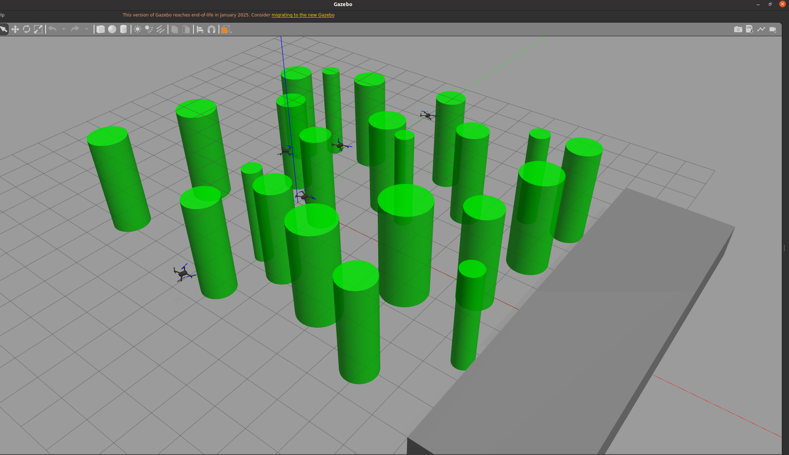

# ALP



ALP is a ROS/Gazebo multi-UAV planning and simulation project focused on platform navigation, obstacle-rich environments, and dynamic obstacle avoidance with EGO-Planner. It is built on top of MUSK and EGO-Planner-Swarm.

Related upstream projects:

- MUSK: https://github.com/xirhxq/musk
- EGO-Planner-Swarm: https://github.com/ZJU-FAST-Lab/ego-planner-swarm

The project compares three moving-obstacle avoidance strategies:

- No early avoidance
- Point-cloud augmentation for predicted obstacle positions
- Time-aware cost/gradient avoidance for moving obstacles

## Dependencies

The recommended runtime environment follows the original MUSK setup:

- Ubuntu 20.04
- ROS Noetic
- Gazebo 11
- PX4 SITL / Gazebo Classic simulation
- MAVROS and MAVROS extras
- GeographicLib datasets for MAVROS
- tmuxinator
- catkin tools / catkin_make
- Python 3
- Python packages: `numpy`, `scipy`, `matplotlib`, `rich`, `tqdm`, `jinja2`

The Docker image provided by this repository installs the main simulation dependencies, including PX4, ROS Noetic, Gazebo, MAVROS, tmuxinator, and Python packages.

## Repository Layout

```text
guidance/ros_ws/
  src/
    multi_uav_formation/        Multi-UAV simulation package
    ego-planner/                EGO-Planner-Swarm source and launch files
  batch_run_experiments.sh      Batch simulation runner
  multi_uav_formation.sh        Multi-UAV launch helper
  setup_runtime_env.sh          Runtime environment setup

docker/                         Docker helper scripts
Dockerfile                      Root Docker image definition
image/image.png                 README preview image
```


## Docker Setup

Build the Docker image:

```bash
cd ALP/docker
./build_docker.sh
```

Run the container from the project root:

```bash
cd ALP
./docker/run_docker.sh
```

Inside the container, the workspace is mounted at:

```text
/app/guidance/ros_ws
```

## Build

There are two workspaces to build: the main ALP/MUSK workspace and the nested EGO-Planner-Swarm workspace.

### 1. Build the main workspace

Inside the Docker container:

```bash
cd /app/guidance/ros_ws
catkin_make
source devel/setup.bash
```

The nested `src/ego-planner` directory contains `CATKIN_IGNORE`, so the main workspace should not recursively build EGO-Planner-Swarm.

### 2. Build EGO-Planner-Swarm

Build EGO separately:

```bash
cd /app/guidance/ros_ws/src/ego-planner
catkin_make -DCMAKE_BUILD_TYPE=Release -j1
source devel/setup.bash
```

This is necessary because catkin/CMake cache files store absolute paths.

## Main Configuration

The platform scene is configured here:

```text
guidance/ros_ws/src/multi_uav_formation/scenes/platform.json
```

Key dynamic-avoidance options:

```json
"earlyAvoidanceEnabled": false,
"movingObstacleTimeAwareCostEnabled": true,
"movingObstacleTimeAwareClearance": 1.1,
"movingObstacleTimeAwareLambda": 0.5,
"movingObstacleTimeAwarePredictionHorizon": 2.0,
"movingObstacleTimeAwareDecayTau": 1.8,
"movingObstacleTimeAwareMaxGrad": 3.0
```

## Avoidance Modes

### No Early Avoidance

```json
"earlyAvoidanceEnabled": false,
"movingObstacleTimeAwareCostEnabled": false
```

Moving obstacles are represented only by their current point-cloud occupancy.

### Point-Cloud Augmentation

```json
"earlyAvoidanceEnabled": true,
"movingObstacleTimeAwareCostEnabled": false
```

Future moving-obstacle positions are inserted into the obstacle point cloud.

### Time-Aware Cost/Gradient Method

```json
"earlyAvoidanceEnabled": false,
"movingObstacleTimeAwareCostEnabled": true
```

Moving obstacles are handled as time-dependent trajectory costs inside the B-spline optimizer.

## Running Experiments

After both workspaces are built, run a platform batch experiment:

```bash
cd /app/guidance/ros_ws
./batch_run_experiments.sh --scene platform --runs 5 --duration 70 --analysis-dir analysis/example_platform_run
```

Experiment outputs are written under:

```text
guidance/ros_ws/data/
guidance/ros_ws/analysis/
```
