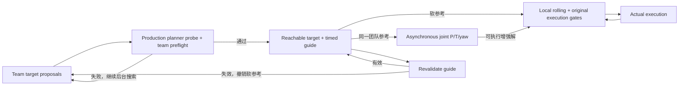

本轮已实现 **planner-backed team target reachability → validated recovery guide → local滚动优化 / joint异步增强**，完成指定构建、全部unit/gradient/contract测试，以及唯一一次完整Scenario A FULL ON + native RViz运行。终点初筛只产生proposal；active target必须具有三机生产规划链和统一世界时间安全验证的轨迹证据。target失效只撤销软参考并重新搜索，local不等待。

**功能链已接通，但本次运行没有实现全局合围改善。** 与feedback_34相比，实际合围从55.44%降至51.90%，同半平面从21.73%升至31.96%；实际target进展率从8/24升至21/49，bearing error P95仅下降约3.12°。0 terminal hold、0碰撞、0 swarm violation、0未验证执行保持；实际brake activation从52增至132，制动生产策略未修改。不能将这次结果描述为稳定收敛或统计显著A/B。

生产结构保持为以下数据链；无target、probe失败和joint失败时，local仍执行原安全滚动链：



目标池继续用真实圆周gap定义筛选最终布局：`g_min≥25° && g_max≤170°`，并检查finite、半径/高度、廉价障碍与LOS/FOV/camera质量。生成器输出到`/encirclement/recovery_proposals`，不能直接激活目标。proposal统一分数为`camera_time − 0.05·reach_cost − 0.01·continuity_cost`；不含120°偏差项。几何不合法的布局仍可作为transition，过渡轨迹没有ratio≥0.8、1.5s内恢复完成或必须靠近target的执行门。

独立ROS进程`team_target_reachability`是`/encirclement/recovery_target`的唯一发布者。它使用三个隔离的EGOPlannerManager实例，复制三机生产参数、订阅相同传感器/障碍预测数据；地图与优化器归worker自身所有。调用原`reboundReplan(..., capture_output)`获得NOMINAL、按原条件触发的SIDE/A*、MINCO/SCP结果，随后复用原final preflight。没有另写直线规划器，也不调用local同步服务、不共享local锁、不提交轨迹、不生成brake。

每次初始probe及最终检查都从实际已执行/已安排的trajectory identity重建共同future activation P/V/A，使用planner/traj_server共享的到期terminal模型。耗时求解结束后重新读取最新轨迹与target预测，统一到达时间，保留原生产路径形状并重建MINCO，再逐机验证dynamics、static、dynamic、Local-SFC和handoff；通过同一`TeamTrajectorySolution`按world time检查三机swarm组合。三架分别可行不足以接受team target。不能解决的冲突直接使proposal失败，不强行绕过检查。

验证成功的target携带plan_id/source hypothesis、reachability generation、validation/activation时间、三机source trajectory id/generation、三条MINCO证据与0.10s间隔的target-relative guide samples。guide来自完整验证后的polynomial，不把插值参考本身当作安全许可。旧guide每轮切取剩余suffix、重锚定到最新future activation并完整复验；失败即发布invalid，随后后台选新目标。真实点态25°/170°NORMAL结束恢复，`TARGET_REACHED`表示进入NORMAL区间，未声称精确到达三个期望bearing。

**可达性的边界：**这是当前地图/预测/状态快照下已找到生产planner可验证路径的工程证据，不是全局可达证明，也不是三机最终一定会执行该完整polynomial的保证。证据从future activation开始；实际commit还独立检查activation前的前驱suffix、最新P/V/A、身份/generation和coverage/deadline。异步运行期间前驱、地图和target会变化，因此不能直接提交旧witness，更不能将其安全结论无限延长。

| 生产入口 | 实现/证据 |
| --- | --- |
| 异步target验证worker | [team_target_reachability.cpp](/home/bob/ALP/egov2_fc65423_constvel/ros_ws/src/EGO-Planner-v2/swarm-playground/tracking_ws/src/planner/plan_manage/src/team_target_reachability.cpp) |
| 原planner capture、guide seed、suffix/reanchor复用 | [planner_manager.cpp](/home/bob/ALP/egov2_fc65423_constvel/ros_ws/src/EGO-Planner-v2/swarm-playground/tracking_ws/src/planner/plan_manage/src/planner_manager.cpp:3865) |
| 共同世界时间team/full preflight | [recovery_probe_contract.h](/home/bob/ALP/egov2_fc65423_constvel/ros_ws/src/EGO-Planner-v2/swarm-playground/tracking_ws/src/planner/plan_manage/include/plan_manage/recovery_probe_contract.h) |
| 共享target/guide数据、插值、代价和短期intent | [team_recovery_target.h](/home/bob/ALP/egov2_fc65423_constvel/ros_ws/src/multi_uav_formation/include/multi_uav_formation/team_recovery_target.h) |
| proposals唯一来源 | [cooperative_viewpoint_manager.cpp](/home/bob/ALP/egov2_fc65423_constvel/ros_ws/src/multi_uav_formation/src/cooperative_viewpoint_manager.cpp:1094) |
| 真实local优化目标 | [poly_traj_optimizer.cpp](/home/bob/ALP/egov2_fc65423_constvel/ros_ws/src/EGO-Planner-v2/swarm-playground/tracking_ws/src/planner/traj_opt/src/poly_traj_optimizer.cpp) |
| 真实joint目标与MINCO P/tau梯度 | [team_visibility_optimizer.cpp](/home/bob/ALP/egov2_fc65423_constvel/ros_ws/src/multi_uav_formation/src/team_visibility_optimizer.cpp) |
| 共享消息 | [TeamRecoveryTarget.msg](/home/bob/ALP/egov2_fc65423_constvel/ros_ws/src/EGO-Planner-v2/swarm-playground/tracking_ws/src/planner/traj_utils/msg/TeamRecoveryTarget.msg)、[RecoveryGuide.msg](/home/bob/ALP/egov2_fc65423_constvel/ros_ws/src/EGO-Planner-v2/swarm-playground/tracking_ws/src/planner/traj_utils/msg/RecoveryGuide.msg)、[RecoveryTargetProposals.msg](/home/bob/ALP/egov2_fc65423_constvel/ros_ws/src/EGO-Planner-v2/swarm-playground/tracking_ws/src/planner/traj_utils/msg/RecoveryTargetProposals.msg) |

23个新增/修改文件含生产、消息、launch、CMake及测试，完整差异见[changed_files.json](/home/bob/ALP/egov2_fc65423_constvel/reachable_team_target_20260911/changed_files.json)、[production_changes.diff](/home/bob/ALP/egov2_fc65423_constvel/reachable_team_target_20260911/production_changes.diff)。planner manager抽成共享库，使worker与原node、production test使用同一实现。

local initializer从当前P/V/A出发，沿guide的剩余waypoints构造MINCO seed；失效或guide余量不足只放弃该seed，继续原initializer和安全候选流程。SIDE、fallback以及最终安全校验仍按原生产行为运行。目标引导允许先侧移/绕障，即使短期最终bearing误差增加也不会被几何条件取消执行。候选排序在安全/可执行候选间比较同一世界时间guide cost，再使用原几何/visibility等比较。

local与joint共享的软目标为`J_guide=Σ_i ||(p_i−target(t))−guide_i(t−epoch)||² / max(1,r_i*²)`，它跟踪整段已验证恢复路径。位置梯度为`2(q−guide)/scale`；显式时间导数包括target velocity和guide velocity。分段线性guide连续、在各段内可导；插值节点采用相邻段约定，并非声称全局C1。joint仍通过原MINCO梯度传播到P/virtual-T，并独立优化yaw/FOV；yaw不替代位置合围。NORMAL时目标软项关闭，J_enc仍保留真实区间违规成本。原J_vis、J_acc、K2/blackout定义和gap/target权重未改。

| 本轮搜索/既有目标参数 | 值和语义 |
| --- | --- |
| worker top_k | 2；每轮仅验证评分靠前的有限proposal |
| worker probe_budget | 0.6s；仅后台计算预算，复用求解器deadline检查 |
| worker period | 0.5s；完成本轮后安排下一轮 |
| candidate combination | 有限最多3³种native组合，受后台预算约束 |
| guide samples | 约0.10s一次，保留共同activation epoch |
| local_target_weight / joint_target_weight | 4 / 1，沿用feedback_34 |
| local_gap_weight | 100，未提高 |
| target_progress_epsilon / target_ranking_epsilon | 0.02 / 0.02，沿用；均不是执行许可 |
| target_max_age | 3s，沿用；过期只撤销参考 |
| local activation margin | 复制现有生产值，本次0.10s；未改原commit/activation契约 |

移除原`PersistentRecoveryTarget`的主动状态机，改成被动`ReachableTargetReference`；删除camera_gain、reach_gain、minimum_dwell、no_progress_time及last_progress/best_error维护，也删除生成器的endpoint-only激活权限。RecoveryIntent从guide短期lookahead派生，保留弱方向偏好，不再承担另一套目标寿命管理。仍有效的路径证据优先复用，失效后按统一proposal score重选；当前实现没有在旧证据仍有效时持续额外探测所有竞争目标。没有新增多层target子状态。

完整的`validatedBrakeSuccessor`、`ensureExecutionCoverage`、`optionalRefinementAllowed`、`finishPlanningBatch`、`lifecycleSuccessorDue`、`validateExecutionTrajectory`、`checkActiveHandoff`、`validatePreviousRemainingTrajectory`以及整个FSM/traj_server与本轮开始时逐段/逐文件一致，见[brake_and_lifecycle_unchanged.json](/home/bob/ALP/egov2_fc65423_constvel/reachable_team_target_20260911/brake_and_lifecycle_unchanged.json)。本轮修改的是恢复参考与可复用probe入口，不是brake duration、trigger、clearance、coverage或execution reserve策略。

指定命令`catkin build traj_utils traj_opt ego_planner multi_uav_formation -j2 --no-status --workspace ros_ws`通过，6/6包成功，构建仍有warnings。全部19组unit/gradient/contract及1项测试参数装载均exit 0。没有仅靠mock证明生产链：

| 用户要求/风险 | 实际覆盖 |
| --- | --- |
| endpoint合法、全路径被静态墙阻断 | 原NOMINAL/SIDE/MINCO capture不能给出可用轨迹；原全路径static gate拒绝，active轨迹未取消 |
| endpoint合法且真实可达 | 三个真实manager生成moving路径，并通过原team preflight；capture不commit、不brake |
| 分别可达但同步冲突 | 原team执行验证拒绝三机crossing组合 |
| future activation P/V/A | 正确重建通过；future velocity不匹配被原handoff gate拒绝 |
| 先偏离的恢复guide | 真实local目标使用timed detour；205°/235°transition未被target条件过滤 |
| target失效/动态变化 | 原dynamic predictor更新使旧路径验证失败；真实target订阅失效后去掉牵引而保留active轨迹 |
| 空target/无进展/joint失败 | generator空pool和local安全successor契约通过；独立worker/无同步等待的wiring检查通过，原增强解失败不阻塞local契约保持 |
| reference进入local | 真实消息订阅→生产MINCO guide seed→生产tracking objective |
| reference进入joint | 完整production joint objective对MINCO waypoint/virtual-T有限差分，最大误差1.36189e−11 |
| ratio<0.8仍可增强 | 真实joint相对目标改善、三ACK/commit契约通过 |
| 120°无额外收益 | 120/120/120与合法非等角布局的同质量比较通过 |
| 原有安全与lifecycle | visibility数学/梯度、geometry、local execution、time-only、pending/generation、PVA、coverage、ROS executor测试全部通过 |

测试记录见[tests.json](/home/bob/ALP/egov2_fc65423_constvel/reachable_team_target_20260911/tests.json)、[test_summary.log](/home/bob/ALP/egov2_fc65423_constvel/reachable_team_target_20260911/test_summary.log)、[recovery_probe_production_test.log](/home/bob/ALP/egov2_fc65423_constvel/reachable_team_target_20260911/recovery_probe_production_test.log)、[persistent_recovery_target_contract_test.log](/home/bob/ALP/egov2_fc65423_constvel/reachable_team_target_20260911/persistent_recovery_target_contract_test.log)；构建见[build_final.log](/home/bob/ALP/egov2_fc65423_constvel/reachable_team_target_20260911/build_final.log)。不可达墙fixture中的A* error是预期拒绝测试输出，不是漏报失败。开发中曾遇到增量编译残留对象的ABI问题，清理重建后完成最终全套测试；恢复了项目原有本地vendor OSQP配置，未更换solver或阈值。最终完整运行使用的binary/.so与通过测试的构建hash一致。

唯一一次场景运行使用`long_cylinder_forest_visibility_stress.json`、FULL ON和native RViz，target正常完成80.204540745s路线。统一有效区间为`[1789093765.969581842, 1789093846.135609627]`，时长80.166027784s。包含有效区间内的启动、退化、制动和低速样本，没有截掉不利片段；没有为美化指标调参重跑。

Geometry由实际odom相对target位置重排circular gaps并按dt积分，gap分位数按时间加权。NORMAL/RECOVERING/SAFETY_DEGRADED是实际trajectory identity关联的预测contract状态：三机全部NORMAL才记团队NORMAL，任一degraded则记团队降级；因此这些状态比例不等于瞬时真实合围比例。无unknown状态样本。degraded episodes按实际几何连续退化区段统计，不做有利于结果的去抖；最后未恢复区段保留。

| Geometry | 本次结果 |
| --- | --- |
| EXECUTED_ENCIRCLEMENT_RATIO | 0.518959 |
| SAME_SEMICIRCLE_RATIO | 0.319603 |
| GAP_MIN P50/P95/min | 50.511758 / 92.229946 / 0.075018 deg |
| GAP_MAX P50/P95/max | 169.118119 / 221.290680 / 314.524656 deg |
| NORMAL_ENCIRCLEMENT_RATIO | 0.362342 |
| RECOVERING_ENCIRCLEMENT_RATIO | 0.087400 |
| SAFETY_DEGRADED_RATIO | 0.550257 |
| DEGRADED_EPISODE_COUNT | 24 |
| DEGRADED_EPISODE_DURATION P50/P95/max | 1.750371 / 3.445407 / 4.000188 s |
| RECOVERY_SUCCESS_COUNT | 23 |
| RECOVERY_TIME P50/P95/max | 1.702820 / 3.463759 / 4.000188 s |

| Target搜索/证据 | 本次结果 |
| --- | --- |
| TARGET_PROPOSAL_COUNT | 1084；101次proposal发布中的候选总数 |
| TARGET_REACHABILITY_CHECK_COUNT | 135 |
| TARGET_REACHABLE_COUNT | 53；包含新证据和成功复验 |
| TARGET_UNREACHABLE_COUNT | 82 |
| TARGET_ACTIVATED_COUNT | 48 |
| TARGET_RESELECTED_COUNT | 48；首个初始化target已在有效区间前激活 |
| TARGET_REUSED_COUNT | 5 |
| TARGET_INVALIDATED_COUNT | 48；36次复验失败＋12次进入NORMAL撤销 |
| TARGET_REACHED_COUNT | 12 |
| REACHABLE_TARGET_RATIO | 53/135 = 0.392593 |
| 新proposal检查 | 94次：48通过/46失败 |
| guide复验 | 41次：5通过/36失败 |
| 实际active target段数 | 49，包含跨入有效区间的首段 |
| TARGET_LIFETIME P50/P95/max | 0.533077 / 1.032572 / 1.070524 s；实际active连续段 |
| TARGET_BEARING_ERROR P50/P95/max | 8.733676 / 108.162445 / 176.140510 deg |
| RECOVERY_GUIDE_PROGRESS_RATIO | 48/54 = 0.888889 |
| TARGET_TO_EXECUTION_PROGRESS_RATE | 21/49 = 0.428571 |
| probe latency P50/P95/max | 3.422260 / 9.929991 / 580.051899 ms |

`REACHABLE_TARGET_RATIO`按检查事件计数，复验不是新目标；它不能解释成1084个proposal中39%都可达。TARGET_LIFETIME采用实际active段，与feedback_34包含inactive时段的同ID寿命不同；对照应参考feedback_34的active段P50/P95/max=1.299301/2.513687/2.800505s。本轮active段更短。

`RECOVERY_GUIDE_PROGRESS_RATIO`基于实际odom：投影到同一plan_id/reachability_generation的target-relative guide，以三机平均归一化弧长坐标的首尾增量>0.01为进展；54个至少两帧的证据窗口中48个满足。它不表示走完88.89%的路径，也不能忽略横向误差单独证明到达。`TARGET_TO_EXECUTION_PROGRESS_RATE`同样基于实际odom，在同一active target连续段内计算`Σ2(1−cos(bearing−bearing*))`，首尾下降>0.02才计成功；49段中21段。该口径与feedback_34的8/24相对应，未用optimizer预测收益替代实际进展。

| 实际active target段首/尾 | before | after |
| --- | --- | --- |
| E_enc mean | 0.535541451 | 0.443491013 |
| E_enc P50 | 0.085158551 | 0.056096684 |
| E_enc P95 | 3.407917989 | 1.959582245 |
| 最终bearing target cost mean | 0.896545448 | 0.896072883 |
| 最终bearing target cost P50 | 0.264290519 | 0.225196971 |
| 最终bearing target cost P95 | 3.292629660 | 3.746660288 |

平均E下降与平均最终target误差几乎不变同时存在。不能由前者断言整个mission的E稳定趋零，也不能把局部guide推进等同于完成团队合围。

| TARGET_UNREACHABLE_REASON | 次数 |
| --- | --- |
| STATIC_PATH_INFEASIBLE | 3 |
| DYNAMIC_PATH_INFEASIBLE | 4 |
| SWARM_CONFLICT | 1 |
| DYNAMICS_INFEASIBLE | 41 |
| MINCO_SCP_FAILURE | 32 |
| EXECUTION_PREFLIGHT_FAILURE | 0 |
| NO_PLANNER_PATH | 0 |
| OTHER | 1 |

原因按最终失败类别归档，不代表穷尽每架机的所有内部失败。36次旧guide复验失败均为DYNAMICS_FAIL：把剩余路径重锚定到滚动执行后的新状态时，原剩余时间下的新polynomial不再满足动力学。系统随即撤销目标并重选，未等待；但这一机制导致高频失效，实际长期目标保持性比feedback_34弱。不能把“曾经验证可达”描述为“下一周期仍能兑现”，也不能据一次运行把全部几何退步归因于该项。没有因此放松动力学、增加权重或重复调参运行。

可达证据离线核验包含55条witness，其中53条在有效区间：所有source identity可定位，所有validation都早于future activation。source在future activation的P/V/A wire重建最大残差分别为`1.824761938e−6 m / 1.139981973e−7 m/s / 1.088823810e−7 m/s²`；共同到达时间最大wire偏差`1.192092896e−7s`，三机反推共同target到达位置最大差`2.360334953e−6m`。witness总duration P50/P95/max为2.287157/3.533106/3.999246s，说明未把1.5s设置为恢复期限。MINCOTraj部分字段float32，离线数值一致性检查采用1e−5量级序列化容差并报告原始残差；生产PVA tolerance仍为0.02/0.05/0.10。

真实执行链并非只收到target消息：667个local planning batch记录了生产`GUIDE_SEED_USED`；通过actual trajectory id→selected candidate id→candidate planning batch关联，确认304次实际local activation来自使用guide seed的候选。26次joint尝试含非零guide objective，确认1组三机共同执行的guide改善增强链。全程另外保留34组完整team执行链，其中18组ratio<0.8；这些总数不能都当成guide贡献。

例：target plan30、guide generation32、coordination generation100、team_solution_id55。joint guide cost `0.123004427→0.115921941`，E `0.056307402→0.055561339`，ratio `0.600000→0.666667`，仍低于0.8而完成proposal→3ACK→commit→3实际activation。proposal时间1789093808.057112455，计划activation1789093808.292308331，剩余lead235.196ms≥原85ms。实际UAV0/1/2 activation时间分别1789093808.2964582 /1789093808.3000894 /1789093808.301585，trajectory id181/182/179，各5个yaw knots。这个事件camera-time before/after均4.5、K2均1，不能声称该饱和事件提升了visibility。

**诊断限制：**原始`[target-guide-adoption] uses_guide=1`本轮实际表示“当前参考可用”，包括BRAKE/persistence时也可能输出，不能单独证明该polynomial经过guide优化。因此没有用它计算实际采用数；304次采用来自上述identity关联重建，brake被排除。生产日志标签未在运行后修改，也未借此重跑。该标签仍需阅读时按参考可用解释；原始日志与校正后的采用明细都保留。

证据：[reachability_evidence_verified.json](/home/bob/ALP/egov2_fc65423_constvel/reachable_team_target_20260911/analysis/reachability_evidence_verified.json)、[actual_guide_adoptions.csv](/home/bob/ALP/egov2_fc65423_constvel/reachable_team_target_20260911/analysis/actual_guide_adoptions.csv)、[execution_trace_summary.json](/home/bob/ALP/egov2_fc65423_constvel/reachable_team_target_20260911/analysis/execution_trace_summary.json)、[guide_execution_examples.json](/home/bob/ALP/egov2_fc65423_constvel/reachable_team_target_20260911/analysis/guide_execution_examples.json)、[reachable_targets.json](/home/bob/ALP/egov2_fc65423_constvel/reachable_team_target_20260911/analysis/reachable_targets.json)、[probe_supplement.json](/home/bob/ALP/egov2_fc65423_constvel/reachable_team_target_20260911/analysis/probe_supplement.json)。

| Visibility（原binary定义） | 本次结果 |
| --- | --- |
| ACCUMULATED_CAMERA_VISIBLE_TIME | 229.887729 camera·s |
| MEAN_VISIBLE | 2.867645 |
| K2 | 0.980982 |
| ALL3 | 0.891275 |
| NONE | 0.004612 |
| LONGEST_K2_LOSS | 0.694950 s |
| LONGEST_BLACKOUT | 0.369714 s |

| UAV | replan Hz | candidate Hz | commit Hz | actual activation Hz | activation interval P50/P95/max s |
| --- | --- | --- | --- | --- | --- |
| 0 | 5.750566 | 8.270336 | 4.278620 | 4.278620 | 0.239985 / 0.410150 / 1.329442 |
| 1 | 5.064489 | 7.584260 | 3.904397 | 3.916871 | 0.269289 / 0.410267 / 1.490208 |
| 2 | 4.191302 | 6.711072 | 4.166353 | 4.166353 | 0.260518 / 0.340376 / 1.100328 |

频率已排除后台probe manager日志。candidate按原stage=CANDIDATE事件统计，非所有SIDE内部试探；commit/activation分别按事件落入统一区间计数，因此UAV1边界可相差1。排除brake activation后的频率为3.330588/3.629967/3.754708Hz，避免用增加brake数夸大有效运动改善。

SAFETY_DEGRADED累计44.111946s，期间actual activation UAV0/1/2为4.443241/4.125866/4.465910Hz。未观察到geometry条件导致等待；absolute ratio rejection=0。150次joint尝试中有失败和1次coordinator timeout，但local持续执行。peer stale的非阻塞性有契约测试，本次没有实际stale-peer样本，不能声称运行覆盖了该故障。

| Lifecycle / safety / performance | 本次结果 |
| --- | --- |
| TRAJECTORY_END_BEFORE_NEXT_ACTIVATION_COUNT | 0 |
| TERMINAL_HOLD_COUNT / TOTAL_DURATION | 0 / 0 s |
| 实际handoff总数 | 991 |
| HANDOFF_DP/DV/DA max | 0.001836318 m / 0.015953630 m/s / 0.091095602 m/s² |
| ghost pending / stale head | 0 / 0 |
| coordinator timeout | 1；只淘汰异步增强结果 |
| PLANNING_LATENCY P50/P95/max | 4.351000 / 16.568600 / 800.263000 ms |
| PLANNING_BUDGET P50/P95/max | 786.035000 / 1071.411200 / 1097.011000 ms |
| COLLISION_SAMPLES | 0 |
| SWARM_CLEARANCE_VIOLATION_SAMPLES | 0 |
| UNVALIDATED_EXECUTED_SAMPLES | 0 |
| MIN_STATIC / MIN_DYNAMIC surface clearance | 0.210078 / 0.736792 m |
| MIN_SWARM elliptical distance | 0.744153428 m，原阈值0.5m |
| MAX_COMMAND_SPEED | 3.028629669 m/s |
| MAX_ODOM_SPEED | 3.148134963 m/s |
| MAX_PLANNER_TRAJECTORY_SPEED | 3.046957331 m/s |
| emergency stop / heartbeat loss | 0 / 0 |

所有handoff通过原0.02/0.05/0.10阈值；原execution coverage/deadline覆盖本次800ms长尾，terminal hold emergency分支仍保留。独立worker保证无local同步等待，不等于额外后台计算对CPU资源完全无影响。

相对feedback_34的hard-safety事件和速度指标，`SAFETY_REGRESSION_OBSERVED=NO`：碰撞/swarm/未验证仍为零，command/odom/planner速度峰值均低于baseline。不过**名义3m/s仍被轻微超过**，原5%可行性容差未改，不能写成严格名义速度全通过；动态最小表面clearance比baseline更小，也不能忽略。该表面距离和planner的中心/椭圆安全距离模型不同，不能把0.736792直接与1.10中心阈值作差判为违规。本结论限定于本次记录指标，不是全面安全证明。

BRAKE_PRODUCTION_LOGIC_CHANGED=NO。本次实际VALIDATED_BRAKE activation为132，有效区间内commit日志为130，差异来自区间边界；BRAKE_UNAVAILABLE=264。feedback_34实际brake为52，本轮明显增加，不能声称新target机制减少制动。低速定义沿用odom speed<0.15m/s且持续≥0.2s，8个episode，duration P50/P95/max=0.351943/1.313929/1.339256s。最长两段为UAV0 mission49.338890–50.678146s及35.338037–36.604931s；低速不全等同于brake，最长段的记录source为PERSISTENCE_FALLBACK。零terminal hold也不等于没有低速或有效运动供给不足。本轮未修改制动生产策略，也未根据次数增加擅自修改SIDE/A*/fallback安全阈值。

| 与feedback_34比较 | feedback_34 | 本次 | 观测变化 |
| --- | --- | --- | --- |
| EXECUTED_ENCIRCLEMENT_RATIO | 0.554449 | 0.518959 | −3.55个百分点 |
| SAME_SEMICIRCLE_RATIO | 0.217326 | 0.319603 | +10.23个百分点，退步 |
| SAFETY_DEGRADED_RATIO | 0.496119 | 0.550257 | +5.41个百分点 |
| camera-time | 228.632941 | 229.887729 | +0.55% |
| MEAN_VISIBLE | 2.851657 | 2.867645 | +0.015988 |
| K2 | 0.977270 | 0.980982 | +0.371个百分点 |
| ALL3 | 0.876085 | 0.891275 | +1.519个百分点 |
| NONE | 0.001698 | 0.004612 | 退步 |
| LONGEST_BLACKOUT | 0.136153s | 0.369714s | 退步 |
| target bearing error P50/P95 | 11.470741/111.284810° | 8.733676/108.162445° | P95仅下降3.12° |
| 实际target进展率 | 8/24=0.333333 | 21/49=0.428571 | +9.52个百分点，样本/分段数不同 |
| actual activation UAV0/1/2 Hz | 3.903937/4.228226/3.953828 | 4.278620/3.916871/4.166353 | rolling继续 |
| TERMINAL_HOLD_COUNT | 0 | 0 | 保持 |
| VALIDATED_BRAKE实际activation | 52 | 132 | 增加80 |

被激活target现在确实有生产路径、共同arrival和完整team预检证据，endpoint-only激活已移除；local/joint/actual execution数据链也有实际执行证明。实际target进展率有所提高，但最终误差P95仍高、平均bearing cost几乎不降，旧guide复验频繁失败，不能认定已经减少几何随机游走。全局true encirclement退步。非阻塞和原安全/lifecycle契约继续保持，这是本轮可以确认的结果边界。没有将单次运行包装为统计显著A/B或宣称全部变化具有单一因果解释。

完整原始数据、分析脚本与可复核结果在[本轮证据目录](/home/bob/ALP/egov2_fc65423_constvel/reachable_team_target_20260911)；geometry曲线见[encirclement_execution.png](/home/bob/ALP/egov2_fc65423_constvel/reachable_team_target_20260911/analysis/encirclement_execution.png)，其余主指标见[encirclement.json](/home/bob/ALP/egov2_fc65423_constvel/reachable_team_target_20260911/analysis/encirclement.json)、[recovery.json](/home/bob/ALP/egov2_fc65423_constvel/reachable_team_target_20260911/analysis/recovery.json)、[summary.json](/home/bob/ALP/egov2_fc65423_constvel/reachable_team_target_20260911/analysis/summary.json)、[supplement.json](/home/bob/ALP/egov2_fc65423_constvel/reachable_team_target_20260911/analysis/supplement.json)、[nonblocking.json](/home/bob/ALP/egov2_fc65423_constvel/reachable_team_target_20260911/analysis/nonblocking.json)。场景SHA256=`430fce52ee31c4a4ea13607e39346e0f04f1af1e3da31eb426a44a61786c4cb0`。

native RViz进程及native配置确已启用；owned截图的OpenGL区域仍为黑色，未声称完成完整人工视觉确认。合围、运动和handoff结论来自odom/PositionCommand/完整polynomial，RViz不代替数值证据。截图见[native_rviz_owned_window.png](/home/bob/ALP/egov2_fc65423_constvel/reachable_team_target_20260911/run/native_rviz_owned_window.png)。target route正常完成后已停止本轮roslaunch/RViz/recorder/test master，12583/12584端口关闭，无本轮进程残留。

运行时binary/加载.so和最终build manifest一致，生产源码运行后未改，见[build_manifest.json](/home/bob/ALP/egov2_fc65423_constvel/reachable_team_target_20260911/build_manifest.json)、[final_verification.json](/home/bob/ALP/egov2_fc65423_constvel/reachable_team_target_20260911/final_verification.json)、[cleanup_and_source_check.json](/home/bob/ALP/egov2_fc65423_constvel/reachable_team_target_20260911/cleanup_and_source_check.json)。本轮未访问或修改禁止目录。正式报告在实现、最终测试、完整运行与分析后创建；实际扫描最大编号并exclusive create，不覆盖历史报告。

```text
PRODUCTION_SOURCE_CHANGED: YES

PLANNER_BACKED_TEAM_TARGET_REACHABILITY_IMPLEMENTED: YES
ENDPOINT_ONLY_TARGET_REACHABILITY_REMOVED: YES

TEAM_TARGET_REQUIRES_TRUE_25_170_GEOMETRY: YES
TRANSITION_REQUIRES_TRUE_25_170_GEOMETRY: NO

REACHABILITY_USES_ACTUAL_FUTURE_ACTIVATION_STATE: YES
TEAM_SWARM_REACHABILITY_CHECKED: YES

RECOVERY_GUIDE_FROM_REACHABILITY_IMPLEMENTED: YES
LOCAL_USES_RECOVERY_GUIDE: YES
JOINT_USES_SHARED_RECOVERY_TARGET_OR_GUIDE: YES

TARGET_UNREACHABLE_TRIGGERS_RESELECTION: YES

TARGET_SEARCH_BLOCKS_LOCAL_REPLAN: NO
TARGET_REACHABILITY_CHECK_BLOCKS_LOCAL_REPLAN: NO
TARGET_RESELECTION_BLOCKS_LOCAL_REPLAN: NO
JOINT_FAILURE_BLOCKS_LOCAL_REPLAN: NO
PENDING_BLOCKS_LOCAL_REPLAN: NO

ABSOLUTE_RECOVERY_RATIO_GATE_REINTRODUCED: NO
NEAR_1P5S_BLOCKS_RECOVERY: NO
LOCAL_GEOMETRY_IS_EXECUTION_GATE: NO

120_DEGREE_RESTORING_REINTRODUCED: NO
120_DEGREE_HAS_EXTRA_TARGET_REWARD: NO

REMOVED_OR_SIMPLIFIED_LEGACY_RECOVERY_LOGIC:
- Removed endpoint-only active target authority from generator.
- Replaced PersistentRecoveryTarget state machine with passive ReachableTargetReference.
- Removed camera_gain/reach_gain/minimum_dwell/no_progress_time and last_progress/best_error bookkeeping.
- Derived RecoveryIntent from validated guide lookahead; one worker owns validity/reselection.

TARGET_PROPOSAL_COUNT: 1084
TARGET_REACHABILITY_CHECK_COUNT: 135
TARGET_REACHABLE_COUNT: 53
TARGET_UNREACHABLE_COUNT: 82
TARGET_ACTIVATED_COUNT: 48
TARGET_RESELECTED_COUNT: 48
TARGET_REUSED_COUNT: 5
TARGET_INVALIDATED_COUNT: 48
TARGET_REACHED_COUNT: 12
REACHABLE_TARGET_RATIO: 0.392593
TARGET_LIFETIME_P50/P95/MAX: 0.533077 / 1.032572 / 1.070524 s
TARGET_BEARING_ERROR_P50/P95/MAX: 8.733676 / 108.162445 / 176.140510 deg
RECOVERY_GUIDE_PROGRESS_RATIO: 0.888889 (48/54, actual odom arc progress)
TARGET_TO_EXECUTION_PROGRESS_RATE: 0.428571 (21/49, actual odom bearing cost)

EXECUTED_ENCIRCLEMENT_RATIO: 0.518959
SAME_SEMICIRCLE_RATIO: 0.319603
NORMAL_ENCIRCLEMENT_RATIO: 0.362342
RECOVERING_ENCIRCLEMENT_RATIO: 0.087400
SAFETY_DEGRADED_RATIO: 0.550257
GAP_MIN_P50/P95/MIN: 50.511758 / 92.229946 / 0.075018 deg
GAP_MAX_P50/P95/MAX: 169.118119 / 221.290680 / 314.524656 deg
DEGRADED_EPISODE_COUNT: 24
DEGRADED_EPISODE_DURATION_P50/P95/MAX: 1.750371 / 3.445407 / 4.000188 s
RECOVERY_SUCCESS_COUNT: 23
RECOVERY_TIME_P50/P95/MAX: 1.702820 / 3.463759 / 4.000188 s

ACCUMULATED_CAMERA_VISIBLE_TIME: 229.887729 camera·s
MEAN_VISIBLE: 2.867645
K2: 0.980982
ALL3: 0.891275
NONE: 0.004612
LONGEST_K2_LOSS: 0.694950 s
LONGEST_BLACKOUT: 0.369714 s

ACTUAL_ACTIVATION_RATE_UAV0/UAV1/UAV2: 4.278620 / 3.916871 / 4.166353 Hz
TRAJECTORY_END_BEFORE_NEXT_ACTIVATION_COUNT: 0
TERMINAL_HOLD_COUNT: 0
TERMINAL_HOLD_TOTAL_DURATION: 0 s

BRAKE_PRODUCTION_LOGIC_CHANGED: NO
VALIDATED_BRAKE_COUNT: 132 actual activations (130 commits within interval)

COLLISION_SAMPLES: 0
SWARM_CLEARANCE_VIOLATION_SAMPLES: 0
UNVALIDATED_EXECUTED_SAMPLES: 0
MAX_COMMAND_SPEED: 3.028629669 m/s
MAX_ODOM_SPEED: 3.148134963 m/s
MAX_PLANNER_TRAJECTORY_SPEED: 3.046957331 m/s
SAFETY_REGRESSION_OBSERVED: NO (relative to feedback_34 recorded hard-safety/speed metrics; nominal 3 m/s still exceeded)

BUILD_PASS: YES
UNIT_TEST_PASS: YES
GRADIENT_TEST_PASS: YES
CONTRACT_TEST_PASS: YES

SCENARIO_A_FULL_RUN_COMPLETED: YES
RVIZ_ENABLED: YES
SIMULATION_LEFT_RUNNING: NO

RRCT_ACCESSED: NO
RRCT_CHANGED: NO

REPORT_FILE:
/home/bob/ALP/egov2_fc65423_constvel/feedback/feedback_35.md
```
